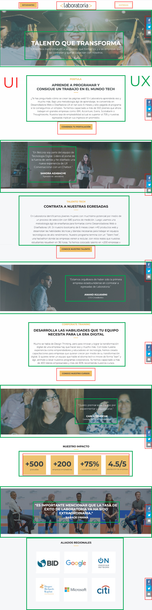
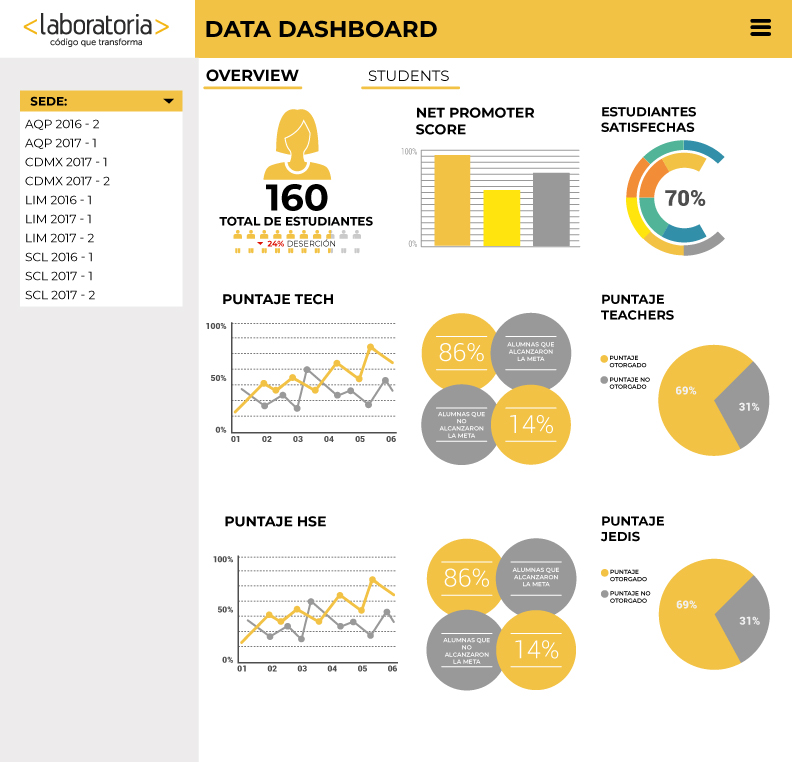
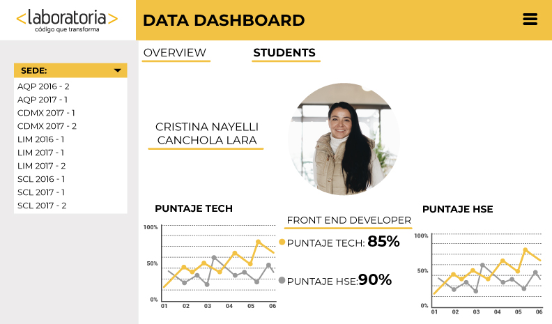

##RETO UX 

## LABORATORIA
**UI:**

*Logo
*Tipografía
*Imágenes
*Paletas de colores: amarillo, blanco y negro
*Botones: fondo amarillo tipografía negra, fondo blanco tipografía y borde amarillo
*Botones redes sociales 
*Diseño de imágenes y texto combinados.
*Textos alineados
*Footer

###Objetivo de negocio:

Postulación de nuevas estudiantes
Empresas contratando nuestro talento LABORATORIA

**Elementos UX:**
*Colores: calidez, esperanza.
*Imágenes alumnas: Confianza, calidez, curiosidad, esperanza.
*Texto alumnas: motivación.
*Contenido para empresas: Confianza, seguridad, credibilidad, posicionamiento, seriedad.

##Sketch

